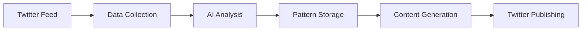

# 🌍 KOT-AI - Kenyan Digital Linguistics Explorer

[](https://opensource.org/licenses/MIT)
[](https://nodejs.org/)
[](https://www.mongodb.com/)

KOT-AI is an innovative digital linguistics research tool that explores and documents the evolution of Sheng - Kenya's dynamic urban language that blends Swahili, English, and local dialects. Using advanced AI and natural language processing, the project creates a living archive of contemporary East African urban linguistics.

## 🎯 Project Overview

KOT-AI continuously analyzes trending Kenyan tweets to:
- Track emerging Sheng expressions and their meanings
- Document usage patterns and cultural context
- Create a searchable database of contemporary urban language
- Generate creative content that demonstrates language evolution

## ✨ Key Features

- **Real-time Language Analysis**: Monitors and processes trending Kenyan tweets
- **Pattern Recognition**: Identifies new Sheng words and expressions
- **Context Mapping**: Documents usage patterns and cultural significance
- **Engagement Tracking**: Measures the popularity and spread of expressions
- **Creative Generation**: Produces culturally-aware, creative content
- **Research Database**: Maintains a structured repository of findings

## 🛠️ Tech Stack

- **Runtime**: Node.js
- **AI Processing**: Claude 3.5 (Anthropic)
- **Data Source**: Twitter API v2
- **Database**: MongoDB
- **Logging**: Winston
- **API Layer**: Express.js

## 🚀 Getting Started

### Prerequisites

```bash
Node.js >= 18.0.0
MongoDB >= 4.4
npm >= 8.0.0
```

### Environment Setup

1. Clone the repository:
```bash
git clone https://github.com/gachezra/KOT-AI.git
cd KOT-AI
```

2. Create `.env` file:
```env
ANTHROPIC_API_KEY=your_anthropic_key
TWITTER_API_KEY=your_twitter_key
TWITTER_API_SECRET=your_twitter_secret
TWITTER_ACCESS_TOKEN=your_access_token
TWITTER_ACCESS_SECRET=your_access_secret
MONGODB_USER=your_mongodb_username
MONGODB_PASS=your_mongodb_password
```

3. Install dependencies:
```bash
npm install
```

4. Start the application:
```bash
npm run dev  # Development mode
npm start    # Production mode
```

## 📊 Data Flow



## 🔍 Core Components

### Data Collection
- Fetches trending tweets from Kenya
- Filters for relevant content and engagement
- Processes text for analysis

### AI Analysis
- Identifies Sheng patterns and expressions
- Maps contextual usage and meanings
- Rates creativity and cultural relevance

### Pattern Storage
- Maintains a MongoDB database of patterns
- Tracks usage frequency and evolution
- Stores examples and context

### Content Generation
- Analyzes stored patterns
- Creates culturally aware content
- Ensures appropriate and engaging output

## 📝 Configuration

Key configuration options in `config.js`:

```javascript
{
  tweetCollection: {
    maxTweetsPerFetch: 50,
    minEngagement: 50,
    fetchInterval: 3600000,  // 1 hour
    locationId: '1528335'    // Kenya
  }
}
```

## 🤝 Contributing

Contributions are welcome! Please check our [Contributing Guidelines](CONTRIBUTING.md) for details.

1. Fork the repository
2. Create your feature branch (`git checkout -b feature/AmazingFeature`)
3. Commit your changes (`git commit -m 'Add some AmazingFeature'`)
4. Push to the branch (`git push origin feature/AmazingFeature`)
5. Open a Pull Request

## 📜 License

This project is licensed under the MIT License - see the [LICENSE](LICENSE) file for details.

## 🙏 Acknowledgments

- Kenyan Twitter community for the vibrant linguistic culture
- Anthropic for AI capabilities
- Twitter for API access
- MongoDB for database solutions

## 📫 Contact

Project Link: [https://github.com/gachezra/KOT-AI](https://github.com/gachezra/KOT-AI)

---
Built with ❤️ for Kenyan language innovation